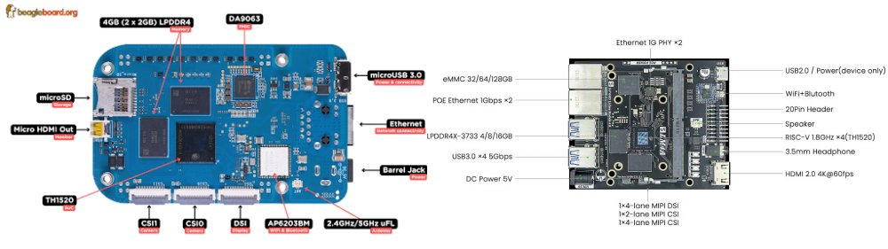
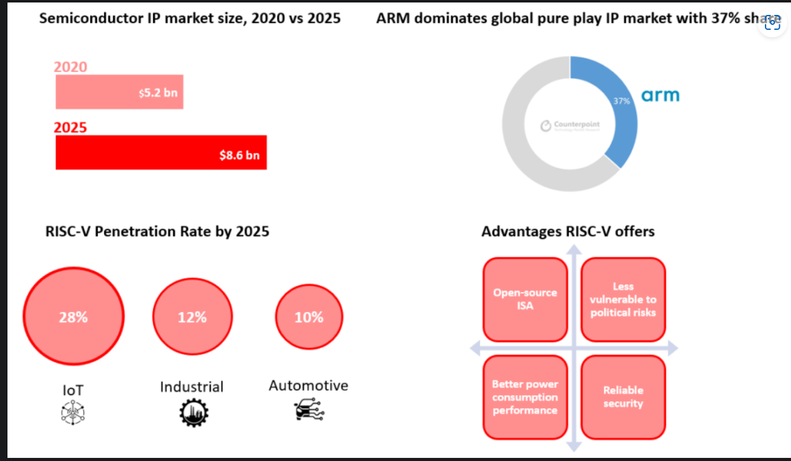

---
title:
- Free/Open-source Hardware
subtitle:
- An overview on the Open-source philosophy and Open Hardware state of the art
author:
- H. Delfino
- J. Rodrigues
- J. Lopes
institute:
- IST-UL
fonttheme:
- "professionalfonts"
monofont:
- "Source Code"
theme:
- CambridgeUS
colortheme:
- beaver
---

# Introduction

## Free (as in Freedom)/Open-source Hardware

Hardware directives or designs that can be freely: 

- Used
- Studied
- Shared
- Improved

FO-S Hardware can be observed in many variations such as:

- Electronics (the focus of this talk)
- Mechatronics (3D printers, Prosthethics, etc.)
- And many other

# Introduction-Timeline and Licenses 

- Hit some licenses here like the OHL etc. be fast we want to go to the eng. meat

# Why Free/Open Hardware?

From the researcher/developer standpoint:

- More tools available that are:
    - Free (as in freedom) to use 
    - Documented
    - Open for study
    - Overall, **adaptable**
- Community spearheaded
    - *Linus Law*: "Given enough eyeballs, all bugs are shallow" 

From the adept/costumer standpoint:

- Transparency and Respect for the user
- Reparability
- Upgradability

# Open Hardware State of the Art

We can split open hardware projects into seven main groups:

- Tools for Hardware Development*
- Instruction Set Architectures (ISAs)
- Systems-on-Chip (SoC)
- Micro-controllers
- Embedded Systems
- Single-Board computers
- Other Computing Systems
- FPGAs

# Tools for Hardware Development

# Open ISAs

Directives for processing operations (i.e. structure and set of instructions)

Talk about AVR and the other Berkley ISAs up until RISC-V.

Cascading effect for opening other technologies.

# Systems-on-Chip

Digital system designs for implementing into FPGAs or silicon:
- Processors

VexRISC-V for example. 

# Embedded Systems

Pinecil

# Microcontrollers

Microcontrollers are computing systems that contain a microprocessor, that can run a simple deterministic Operating System (such as a RTOS) or a simply flashed program, making them ideal for low-power and low-cost IoT integration and tasks.

# Arduino

Launched in Italy in 2005 it is arguably the most well known microcontroller and Open Hardware Project as of 2023.
The initial project goal was to create simple, low cost tools for creating digital projects by non-engineers, which has since evolved into the production of , which since have been replicated multiple times

Most Arduino boards have either :

- A closed-design Atmel AVR microprocessor (built with a open modified-Harvard ISA)
    - Bulk of the Arduino market
        - Simple to use
        - Low-cost
-  A ARM-Cortex (Since Revision 4) 

# Seeed

The Seeed project 

# HiFive Boards

# Single-Board Computers

Single-Board Computers (SBCs) are full computing systems, running an Operating System (such as Linux-based OS's) and providing above-microcontroller performance at a relative low-power and low-cost. Therefore they can be designated for more complex IoT and Embedded functions and simple Desktop operations.

- **Raspberry Pi** (2012-present): Partial Open board design, Closed Processor and ISA (ARM)

- **VisionFive** (2021-present): Open board design, Closed Processor, Open ISA (RISC-V)

- **MangoPi** (2022): Open board design, Closed Processor Design, Open ISA (RISC-V)

- **BeagleV®-Ahead** (2023): Open board design, Open Processor Design, Open ISA (RISC-V)

- **Lichee Pi 4A** (2023): Open board design, Open Processor Design, Open ISA (RISC-V)

# Single-Board Computers

# C910 processor

{ width=90% }

# FPGAs 

Field-Programmable Gate Arrays are the smallest unit for reconfigurable hardware:

- A mesh of CLBs (Configurable Logic Blocks) containing LUTs (Look-Up tables) allows hardware-level reconfigurability
    - Look-Up Tables are small memory devices that contain the logic outputs for different logic inputs
- The mesh then interacts with DSPs (Digital Signal Processor)
- The FPGA can then be integrated into a board to expand on the I/O capabilities

As of now most Open-Hardware FPGA boards are based on:

- Lattice's ICeStorm designed devices:
    - ICe40 boards
    - ECP5
-Microchip PolarFire devices:
    - BeagleV®-Fire 

# ICE40

# Roadmap

# So you want to develop F-OS Hardware?

# Conclusion

To sum up here are some bullet points that you hopefully retained from this
presentation:

- What is Free and Open Hardware
- Basic notions on the presented technologies
- Advantages of opening hardware designs
