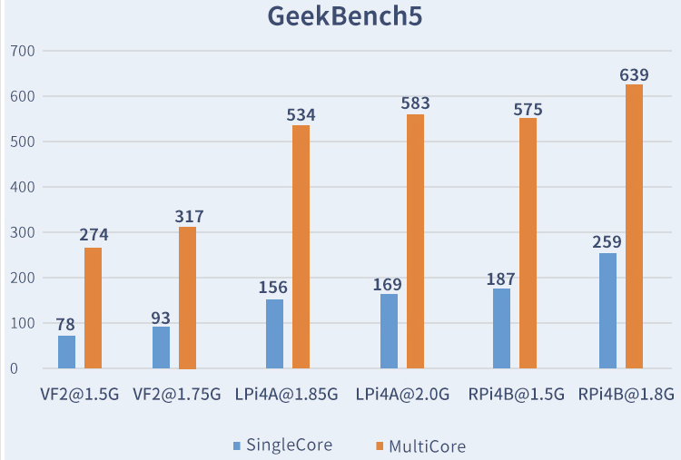

---
title:
- Free/Open-source Hardware
subtitle:
- An overview on the Open-source philosophy and Open Hardware state of the art
author:
- H. Delfino
- J. Rodrigues
- J. Lopes
institute:
- IST-UL
fonttheme:
- "professionalfonts"
monofont:
- "Source Code"
theme:
- CambridgeUS
colortheme:
- beaver
---

# Introduction

## Free (as in Freedom)/Open-source Hardware

Hardware directives or designs that can be freely: 

- Used
- Studied
- Shared
- Improved

FO-S Hardware can be observed in many variations such as:

- Electronics (the focus of this talk)
- Mechatronics (3D printers, Prosthethics, etc.)
- And many others

# Why Free/Open Hardware?

From the researcher/developer standpoint:

- More tools available that are:
    - Free (as in freedom) to use 
    - Documented
    - Open for study
    - Overall, **adaptable**
- Community spearheaded
    - *Linus Law*: "Given enough eyeballs, all bugs are shallow" 

From the adept/costumer standpoint:

- Transparency and Respect for the user
- Reparability
- Upgradability

# Licensing

- Permissive Licensing
    - CERN Open Hardware License
    - MIT Open-Source License
- Weakly-reciprocal licensing
- Strong-reciprocal licensing
- (not only) Documentation Licensing
    - CC0 
    - CC-BY
    - CC-BY-SA

# Approaches to licensing in europe

Can be:

- Truly open source
- Meaningful for Open Hardware.
- Permissive or weakly-reciprocal

Licenses need to be carefully selected to avoid potential contamination

EU is lagging today:

- The fear that "giving everything away" to competitors will harm the economy

- Can be a strategic move from countries

- <https://www.linuxfoundation.org/resources/publications/understanding-us-export-controls-with-open-source-projects>

# Market

Currenttly there is a growing market for RISC-V:

- $550 Billion  in 2021
- 1 Trilion expected in 2030
- Risc architecures grew during the covid crisis
- Intel’s launch of a $1 billion fund to support RISC-V companies

# Market Topology-CISC vs RISC

# Automotive Applications

Eletronic components/total car value

- 16% in 2019
- expected to grow to 35% By 2025. 

RISC-V can help European industry to provide flexible and reusable IP
blocks in order to compete on the world market.

# Communication and Networking Applications

Communication and networking chips

- 32% of total semiconductor market(USD $140 Bn) in 2020

The necessity of working from home

Upcoming 6G and Wifi7 developments

RISC-V is expected to be a key driver for new IC´s

# Industrial Applications and Manufacturing

The expected growth in industrial applications is huge:

- Predictive maintenance grow by 38% per annum between 2017 and 2022 to reach USD $11 Bn.   
- Additive manufacturing (3D printing) predicted to grow annually by 15% between 2015 and 2025 to reach over USD $20 Bn
- Virtual reality.
    - BIS Research forecasts a market of around USD $40 Bn by 2025
    - Annual growth between 2018 and 2025 of 65%.

Risc-V is a strong growing area for embedded microprocessors

Risc-V can  become a differentiator

# Avionics Applications

Market expected to grow from USD 46.7 Billion in 2022 USD to USD 66.3 Billion by 2027

this industry there is a strong safety, security
and certification culture.

RISC-V is inspectable and auditable

- Potential to meet safety requirements

# Health and Well-Being Applications

10% of the EU’s gross domestic product being spent in Healthcare

Semiconductor usage is growing in several different applications

The strongest growth areas

- Remote patient monitoring
- Wearable devices for health monitoring and well-being

RISC-V is an enabler for secure, safe and reliable processing in medical devices.

# Hypervisors and Separation Kernel Applications

Global market expected to grow

Separation kernel vendors announced software support for RISC-V

# Roadmap

1) Processors (RISC-V, beyond RISC-V, ultra-low power and high-end)

2) Accelerators-Domain Specific Architectures

3) Peripherals and SoC

# Processors (RISC-V, beyond RISC-V, ultra-low power and high-end)

Strategic key needs for the development and support for:
- Different domain focused processors
- The IP required to build complete SoCs

Align the software roadmap the hardware roadmap:
- Efforts should be focused on supporting RISC-V implementations
- RV64GC and RV32GC

# The Roadmap for RISC-V

# General ISA market analysis

{ width=87% }

# Accelerators-Domain Specific Architectures

Hardware specialized for a particular domain of applications

- Deep learning
- Simulation
- Bioinformatics
- Image processing

Accelerators are one approach to implement a DSA

- Help processor for accelerating a specific application
- Faster
- Energy efficient
- More secure

# Accelerators-Domain Specific Architectures

Accelerators are implemented as is usual for the target technology (e.g., FPGA, ASIC)

- Would profit immediately with OS
- OS would encouraging reuse
- NVIDIA’s NVDLA19 Machine Learning inference accelerator

# NVDLA19

{ width=90% }

# Peripherals and SoC

SoC infrastructure

- Provide all the required external and internal interfaces and infrastructures
- Very strict NDA(non-disclosure agreement)
- Providing acess to information $\rightarrow$ growing industry
- OS Hardware role

# Networks on a Chip

## Networks on a Chip

Important elements for interconnecting IPs in a scalable way.

# Chiplet

- integrated circuit block designed to work with other similar chiplets
    - opportunity for the semiconductor industry
    - vantages of the traditional chips
        - Die area per unit bandwidth
        - Power per bit
        - Scalability of bandwidth
    - Die-to-Die (D2D) communication is the “missing link”
    - Interoperability by open source is the key

# Open Hardware State of the Art

We can split open hardware projects into 1+5 main basic groups:

- Tools for Hardware Development 
- Instruction Set Architectures (ISAs)
- Systems-on-Chip (SoC)
- Micro-controllers
- Single-Board computers
- FPGAs

# Tools for Hardware Development

Despite being software, these tools are essential to open Hardware:
- Accessible
- Open breeds open

Tools for:

- Circuit Design/EDA
    - KiCAD
- Hardware Simulation and Synthesis
    - GHDL
    - Verilator
    - Yosys
- Waveforms viewing
    - GTKWave
- Programmers 
  - ecpprog
- Visual editors
    - IceStudio

# Tools for Hardware Development - IceStorm Flow example

1) Start Hardware design and synthesis with **Yosys**

2) Do place-and-route for desired FPGA architecture with **nextpnr**

3) Generate and Flash bitstream with the **IceStorm suite** (icepack, iceprog, etc.)   

# KiCAD

# Open ISAs

Directives for processing operations (i.e. structure, set of instructions, supported data types , registers etc.)

- **Harvard Architectures**: open directive to design directives
    - **Atmel's AVR Architecture** (1996): Open and Documented architecture 
        - Directed for microcontrollers (we will see later!)
- **OpenSPARC**
- **MIPS** (1985-2021)
    - Partially opened in 2019 and closed again later that year  
- **RISC-V** (2014-present)

# Systems-on-Chip

Digital system designs for implementing into FPGAs or silicon for example, processors

Community-developed:

- **PicoRV32** (2018): 32-bit CPU size-optimized
- **IOb-SoC** (2020): Portuguese SoC based on the PicoRV32, which includes SRAM subsystem and UART bus
- **VexRISC-V** (2021): 32-bit CPU for FPGA deployment
- And many many more each day...

Company-developed:

- We will take on some of them later ;^)

# Microcontrollers

## Microcontrollers?

Computing systems that contain a microprocessor, that can run a simple deterministic Operating System (such as a RTOS) or a simply flashed program, making them ideal for low-power and low-cost IoT integration and tasks.

# Arduino

Launched in Italy in 2005 it is arguably the most well known microcontroller and Open Hardware Project as of 2023.
The initial project goal was to create simple, low cost tools for creating digital projects by non-engineers, which has since evolved into the production of , which since have been replicated multiple times

Most Arduino boards have either:

- A closed-design Atmel AVR microprocessor (built with an open modified-Harvard ISA)
    - Bulk of the Arduino market
        - Simple to use
        - Low-cost
-  A ARM-Cortex (Since Revision 4) 

# SiFive/HiFive1 boards

Launched by **SiFive**:

- Founded by Berkley RISC-V researchers
- One of the first companies to launch a RISC-V chip commercially
- First company to launch comercially a open RISC-V chip
    - Freedom E310 (2016)

**HiFive1** (2017-present):

- Open board Design
- Open ISA and processor design
- Arduino Compatible

# Hifive1

{ width=80% }

# Single-Board Computers

## Single-Board Computers (SBCs)?

Full computing systems, running an Operating System (such as Linux-based OS's) and providing above-microcontroller performance at a relative low-power and low-cost. Therefore they can be designated for more complex IoT and Embedded functions and simple Desktop operations.

# Single-Board Computers Market

- **Raspberry Pi** (2012-present): Partial Open board design, Closed Processor and ISA (ARM)
    
    - Since 2012 many Raspberry Pi variations and similiar-ARM SBCs have been launched, being the dominating market force.
    
- **HiFive Unmatched** (2020): Open board design, Open Processor, Open ISA (RISC-V)
    - Development Platform, with a limited run

- **VisionFive** (2021-present): Open board design, Closed Processor, Open ISA (RISC-V)

- **BeagleV-Ahead** (2023): Open board design, (Partial) Open Processor, Open ISA (RISC-V)

- **Lichee Pi 4A** (2023): Open board design, (Partial) Open Processor, Open ISA (RISC-V)

# Open Single-Board Computers

{ width=85% }

# Open Single-Board Computers

{ width=90% }

# Open Single-Board Computers

# C910 processor

{ width=90% }

# SBCs Benchmarks - R-V vs ARM

{ width=80% }

# The Future of SBCs

{ width=90% }

# FPGAs
 
## Field-Programmable Gate Arrays?

Smallest unit for reconfigurable hardware:

- A mesh of CLBs (Configurable Logic Blocks) containing LUTs (Look-Up tables) allows hardware-level reconfigurability
    - Look-Up Tables are small memory devices that contain the logic outputs for different logic inputs
- The mesh then interacts with DSPs (Digital Signal Processor)
- The FPGA can then be integrated into a board to expand on the I/O capabilities

# FPGAs

As of now most Open-Hardware FPGA boards are based on well-documented closed FPGA devices such as:

- Lattice's ECP5 series devices:
- Lattice's iCE40 series:
        - iCEBreaker
        - TinyFPGA BX
- Microchip PolarFire devices:
    - BeagleV-Fire
- Xilinx Spartan-7 device:
    - S7 mini

# BeagleV-Fire

# Wrap-up, a Classroom Exercise

So you want to develop F-OS Hardware?

# Conclusion

To sum up here are some bullet points that you hopefully retained from this
presentation:

- What is Free and Open Hardware
- How the Open Hardware market is progressing
- Basic notions on the presented technologies
- Advantages of opening hardware designs

# Sources

- <https://riscv.org/>
- <https://hackaday.com/2023/11/07/trouble-brewing-for-risc-v-as-issue-of-technology-transfer-is-questioned/> 
- <https://riscv.org/wp-content/uploads/2017/02/riscv_fosdem17.pdf>
- <https://www.openhwgroup.org/>
- <https://sipeed.com/licheepi4a>
- <https://www.beagleboard.org/>
- <https://www.starfivetech.com/en/site/boards>

# Acknowledgements

- Prof. Leonel Sousa, IST-UL and INESC-ID
